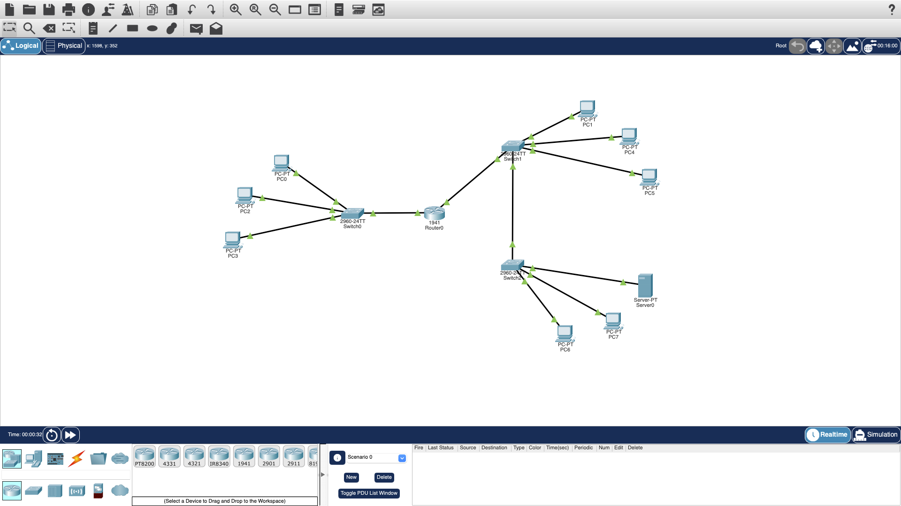

# Secure Enterprise Network Simulation (Cisco Packet Tracer)

An enterprise network simulation with VLAN segmentation, inter-VLAN routing, trunking, and ACL-based security using Cisco Packet Tracer.

## Network Topology

## Project Overview

This project simulates a secure enterprise network environment using Cisco Packet Tracer. The network is designed to represent multiple departments within an organisation, including HR, IT, and Cybersecurity, with controlled communication between them. The implementation focuses on network segmentation, inter-VLAN communication, and access control to ensure secure and efficient data flow across departments.

The design reflects real-world enterprise networking practices, including segmentation for security and controlled inter-department communication.

## Network Architecture

The network consists of three main departments:

- **HR Network** – 192.168.1.0/24  
- **IT Network** – 192.168.2.0/24  
- **Cybersecurity Network** – 192.168.3.0/24

Each department is isolated using VLANs, with communication handled using inter-VLAN routing via a router over trunk links between switches.
 
A shared server is hosted within the Cybersecurity network and is accessible to HR and IT, while direct access to other Cybersecurity devices is restricted.

## Tools and Technologies

- Cisco Packet Tracer  
- VLAN Segmentation  
- Inter-VLAN Routing (Router-on-a-Stick)  
- Trunking (802.1Q)  
- Access Control Lists (ACLs)  
- Static IP Addressing  

## Key Features

- Segmentation of departments using VLANs  
- Trunk links to allow multiple VLANs over a single connection  
- Router subinterfaces configured for inter-VLAN communication  
- Controlled access between departments using ACLs  
- End-to-end connectivity testing using ICMP (ping)

## Security Implementation

Access Control Lists (ACLs) were implemented to enforce security policies:

- **Cybersecurity Network**: Full access to all networks  
- **IT Network**: Access to HR and shared server only  
- **HR Network**: Access to IT and shared server only  
- Direct access to Cybersecurity devices is blocked from other departments  

This ensures sensitive systems remain protected while still allowing necessary communication.

## Testing & Validation

Network functionality was tested using ping commands:

- Successful communication within VLANs
- Successful inter-VLAN routing via the router
- Blocked traffic based on ACL rules (e.g. HR → Cyber PCs)
- Verified security enforcement through “Destination host unreachable” responses

## Future Improvements

- Implement DHCP for automatic IP address assignment  
- Introduce a dedicated Server VLAN (DMZ-style architecture)  
- Add firewall rules for more granular traffic control  
- Simulate external network access using NAT  

## Author

Sneha Besu  
